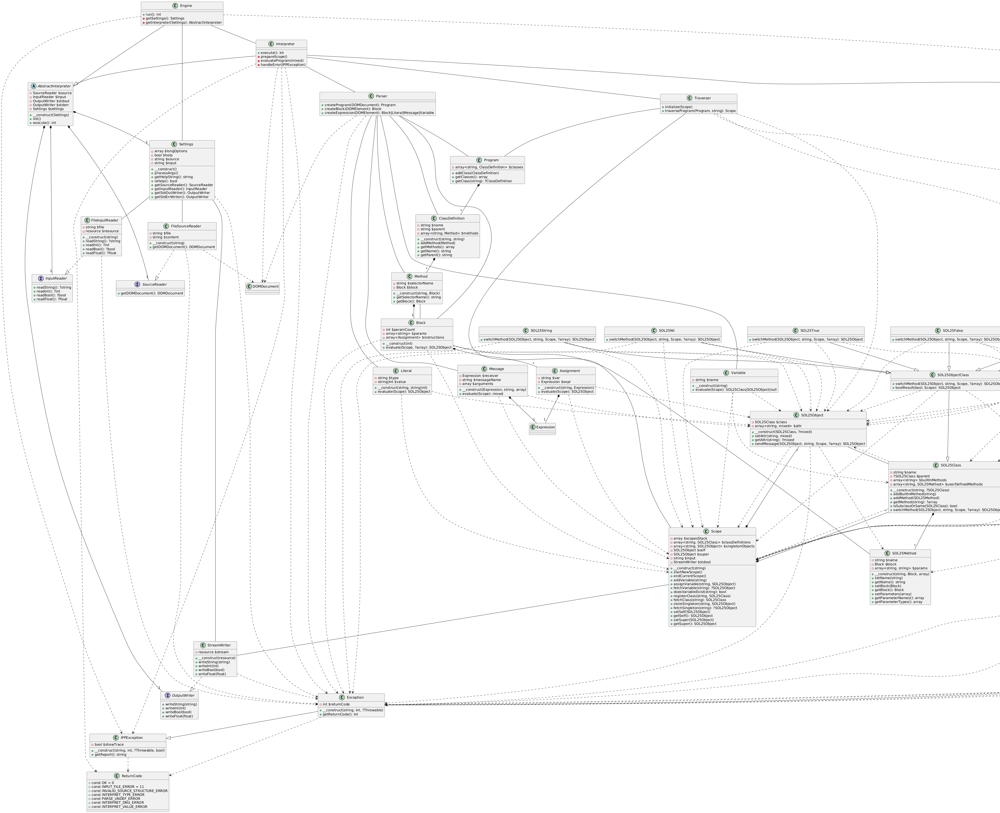

# Documentation of Project Implementation for IPP 2024/2025
---
### Name and surname: Adam Veselý
### Login: xvesela00
---
## Overview
- The **SOL25** Interpreter is a PHP-based implementation of a Smalltalk-inspired object-oriented programming language called **SOL25**. It parses, traverses, and evaluates programs written in **SOL25**, provided as XML input. The interpreter supports object-oriented features such as classes, methods, message passing, inheritance, and built-in types (e.g., `Integer`, `String`, `Boolean`, `Nil`, `Block`).

- The system uses an **Abstract Syntax Tree** (AST) to represent programs, a scope-based evaluation model, and a modular class hierarchy for built-in and user-defined types. It is executed by processing the Main class's run method, with results output via standard streams.
---
## Design Overview

- The **SOL25** Interpreter follows a modular, object-oriented architecture with distinct components for parsing, traversing, evaluating, and executing SOL25 programs. The key layers are:

    - **Input Processing:**

        - The Parser class processes XML input using `DOMDocument`, creating a Program object with `ClassDefinition` instances.
        - Each `ClassDefinition` includes methods (`Method`) and a parent class for inheritance.

    - **Program Traversal:**

        - The Traverser class initializes built-in classes (e.g., `Object`, `Integer`, `String`, `True`, `False`, `Nil`, `Block`) and registers user-defined classes in a Scope.
        - Built-in classes inherit from `SOL25ObjectClass`, which extends `SOL25Class`, providing method dispatch via `switchMethod`.

    - **Evaluation:**

        - The `Evaluate` class initiates execution by invoking the Main class's run method, using a Scope to manage variables, classes, and singletons.
        - The `Scope` class handles dynamic scoping, storing variables, class definitions, and singleton objects (`true`, `false`, `nil`).
        - AST nodes (`Message`, `Literal`, `Variable`, `Block`, `Assignment`) are evaluated recursively, with `SOL25Object` handling message passing.

    - **Object Model:**

        - `SOL25Object` represents instances with attributes and a reference to their `SOL25Class`.
        - `SOL25Class` manages built-in and user-defined methods, supporting inheritance.
        - Built-in types (`SOL25Integer`, `SOL25String`, `SOL25True`, `SOL25False`, `SOL25Nil`, `SOL25Block`) implement type-specific methods.

    - **Error Handling:**

        - The `Exception` class, extending `IPPException`, handles errors with specific return codes (e.g., `INTERPRET_TYPE_ERROR`, `INTERPRET_DNU_ERROR`).

---
## Class Diagram

The class diagram below illustrates the relationships between classes, including inheritance, composition, association, and dependencies among core components, **SOL25** types, and **AST** nodes.

Note: To generate class-diagram.png, use the PlantUML code `puml.txt.` in `docs/`. Render it using a PlantUML tool (e.g., [online PlantUML server](http://www.plantuml.com)).

---
## File Structure
The project consists of the following PHP files in the `IPP\Student namespace`:

- **Program Representation:**

    - `Program.php`: Manages a collection of class definitions.
    - `ClassDefinition.php`: Defines a class with name, parent, and methods.

- **Object Model:**

    - `SOL25Class.php`: Base class for all classes, handling methods and inheritance.
    - `SOL25ObjectClass.php`: Abstract base for built-in types.
    - `SOL25Object.php`: Represents object instances.
    - `SOL25Block.php`, `SOL25Integer.php`, `SOL25String.php`, `SOL25True.php`, `SOL25False.php`, `SOL25Nil.php`: Built-in type implementations.

- **AST Nodes:**

    - `Method.php`, `SOL25Method.php`: Represent methods with selectors and blocks.
    - `Block.php`: Encapsulates instructions and parameters.
    - `Message.php`: Models message passing.
    - `Literal.php`: Represents constant values.
    - `Variable.php`: Handles variable access.
    - `Assignment.php`: Manages variable assignments.

- **Execution Components**:
    - `Parser.php`: Parses XML into a program AST.
    - `Traverser.php`: Initializes and registers classes.
    - `Evaluate.php`: Executes the program.
    - `Scope.php`: Manages variables, classes, and singletons.
    - `Interpreter.php`: Orchestrates execution.
    - `Exception.php`: Custom error handling.

 - **Core IPP classes** (`AbstractInterpreter`, `Settings`, `StreamWriter`, etc.) are in the IPP\Core namespace, they create the core of the program, I have no contribution to any files that are not in the `student/` folder.
 ---
## Implementation Details

- The **SOL25** Interpreter is implemented in PHP within the IPP\Student namespace, leveraging IPP\Core for I/O and exception handling. Key implementation aspects include:
    - **Core Components**

        - `Interpreter`: Extends `AbstractInterpreter`, coordinating parsing, traversal, and evaluation using `Parser`, `Traverser`, and `Evaluate`.
        - `Parser`: Uses `DOM` parsing to convert XML into a Program object, creating AST nodes for classes, methods, and expressions.
        - `Traverser`: Sets up built-in classes and user-defined classes in a Scope, ensuring proper initialization.
        - `Evaluate`: Executes the Main class's run method, managing `self` and `super` in the Scope.
        - `Scope`: Supports nested scopes via a stack, providing methods for variable/class lookup and assignment.

    - **AST Nodes**

        - `Program`: Stores ClassDefinition objects for the **SOL25** program.
        - `ClassDefinition`: Defines a class with a name, parent, and methods.
        - `Method`: Represents a method with a selector and Block.
        - `Block`: Executes a sequence of Assignment instructions in a new scope.
        - `Message`: Handles message passing via `SOL25Object`::sendMessage.
        - `Literal`: Converts constant values into `SOL25Object` instances.
        - `Variable`: Resolves to `SOL25Object` or `SOL25Class` for `self`, `super`, or `class` names.
        - `Assignment`: Assigns expression results to variables, supporting no-assignment (_) cases.

    - **Object Model**

        - `SOL25Class`: Manages methods and inheritance.
        - `SOL25ObjectClass`: Provides method dispatch for built-in types.
        - `SOL25Object`: Stores attributes and delegates method calls.
        - `Built-in` Types:
            - `SOL25Block`: Supports whileTrue and block evaluation.
            - `SOL25Integer`: Implements arithmetic (e.g., plus:, timesRepeat:).
            - `SOL25String`: Handles string operations (e.g., concatenateWith:, print).
            - `SOL25True`/`SOL25False`: Supports boolean logic (e.g., ifTrue:ifFalse:).
            - `SOL25Nil`: Represents the nil singleton.

    - **Error Handling**

        - `Exception` extends `IPPException`, using `ReturnCode` constants for errors like `INTERPRET_DNU_ERROR` (undefined method) or `INTERPRET_VALUE_ERROR` (e.g., division by zero).
        - Errors are thrown during parsing, traversal, or evaluation for invalid inputs or runtime issues.

    - **I/O Handling**

        - `StreamWriter`, `FileInputReader`, and `FileSourceReader` implement `OutputWriter`, `InputReader`, and `SourceReader` interfaces for standard I/O and file operations.
        - `Settings` configures input/output streams via command-line arguments.
---
## Usage
- To run the SOL25 Interpreter:

    - Ensure PHP is installed with the DOM extension enabled.

    - Prepare a **SOL25** program in an XML file (e.g., program.xml).

    - Execute the interpreter:
        - `php interpreter.php --source=program.xml --input=input.txt`

    - The interpreter parses the XML, initializes the scope, evaluates the Main class's run method, and outputs results via StreamWriter.
- To compile the Interpreter, use `make` in the root folder of the project.

---
## Testing
- The **SOL25** Interpreter was tested using public tests from the proffesors and student tests available at https://github.com/Kubikuli/IPP_proj2-tests. The tests cover various aspects of the interpreter's functionality, including:

    - **Parsing**: Valid and invalid XML inputs to ensure correct **AST** construction and error handling.
    - **Class and Method Handling**: User-defined classes, inheritance, and method invocation.
    - **Built-in Types**: Operations on `Integer`, `String`, `Boolean`, `Nil`, and `Block` types.
    - **Message Passing**: Correct evaluation of messages with varying receivers and arguments.
    - **Error Cases**: Type errors, undefined methods, division by zero, and invalid variable access.
---
## Bibliography

**Smalltalk-80**: The Language and its Implementation by Adele Goldberg and David Robson (1983): Inspired SOL25's object-oriented model and message-passing semantics.
**PHP Manual**: Official documentation for DOM parsing and OOP (https://www.php.net/manual/en/).
**PlantUML Documentation**: Used for generating the class diagram (https://plantuml.com/).
**Chat GPT (AI)**: Used for explaining harder-to-grasp concepts and help with documentation design. It also helped with debugging and refactoring source code.
