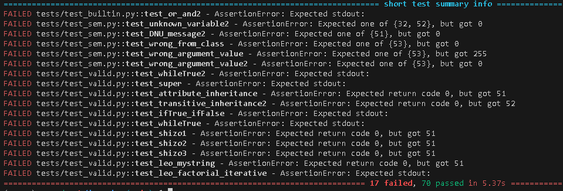

# Implementation Documentation for Task 2 – IPP 2024/2025
**Name:** Miroslav Bašista

**Login:** xbasism00

---

## Project Description

The second part of the project involves creating an interpreter in PHP 8.4 that processes an XML representation of the AST of a program written in the SOL25 language. The interpreter must execute the program according to the language's semantics, handling input/output operations and managing runtime errors

## Implementation Details

The entire project consists of three main parts: the first part creates an AST tree from the DOM documents, then this tree is traversed, and classes and other elements are added to scopes. In the final part, the program is interpreted, and the main method is executed.

### Main OOP Design

Since everything in SOL25 is treated as an object, I designed my object-oriented architecture accordingly. It includes classes located in the `AstTree/` namespace that represent the AST nodes, corresponding to the core structural elements of SOL25 code.
In addition, the `Sol25/` namespace contains classes that represent both built-in and user-defined classes. Each of these extends from `SolObjectClass`, which in turn inherits from `SolClass`. The SolClass serves as the foundation for representing user-defined classes.
Object instantiation is handled through the `SolObject` class. This class is responsible not only for creating instances but also for managing message passing between objects.
A key component of the system is the `SolMethod` class, which holds method parameters as well as the `method body`. The body is stored as an `AstBloc`k, which is evaluated during method execution by the interpreter.

### Dom Document to Ast Tree

In `Interpreter.php`, I use `createProgram()` to create the Program AST node, which is implemented in `DomParser.php`. Then, I call the `createBlock()` and `createExpression()` functions to create the necessary nodes.

### Walking trough tree

Next, I send the AST tree to the `traverseProgram()` function, which I implement in `WalkingTree()`. I create an object for the scope, initialize the built-in classes and their methods, and then traverse the entire tree, adding class definitions and their methods to the scopes.

### Evaluating Program

At the beginning, the program retrieves the Main class and the run method, which is then evaluated. The evaluation works on the principle that each necessary AST node contains an `evaluate` method, which is called to return the required object. This allows the program to "dive" into execution and "emerge" as needed. Next, I will describe the most important files of this part.

#### SolObjectClass.php switchMethod()

This method is present in each BuiltIn class and contains a switch statement that decides, based on the selector's name, which method should be executed. It then executes the corresponding method and returns the resulting object. This mechanism allows the program to dynamically choose and invoke the correct method based on the provided selector.

#### SolObject.php sendMessage()

This method is used to determine the type of message being sent. It starts by checking if the specified method exists for the class. If it does, it evaluates whether the method is built-in or user-defined. Since user-defined methods can be evaluated from the tree, but built-ins are manually defined, the method processes these cases differently.

If the message is not related to a method, the next step is to check if it is a value for a `SolObject` or a `new` or `from:` command. If neither of these is the case, the method proceeds to create an attribute for the class. This ensures that all types of messages, including method calls, value retrievals, and attribute assignments, are properly handled and processed.

#### AstBlock.php evaluate()

I chose this method to illustrate how `evaluate` works for other AST classes, as the process is very similar. First, we enter a new scope and add parameters as variables. If it's a block that receives messages, the parameter values are also set accordingly.

Next, the instructions inside the block are evaluated — these are mostly of type `Assignment`. The last evaluated instruction is stored in `lastResult` and returned up. 

## UML Diagram
For a more detailed view of the image, I recommend opening it from the `images/uml_diagram` folder.

## Testing
For testing, I used student-provided tests, which thoroughly tested my program and covered a wide range of scenarios. [IPP_proj2-tests](https://github.com/Kubikuli/IPP_proj2-tests)

## AI Usage in Project

At the beginning, I discussed with AI what the best approach might be and consulted it with my ideas. This gave me a better perspective on how the interpreter could work. I also used AI to help correct grammatical errors and created some error messages in the code.
